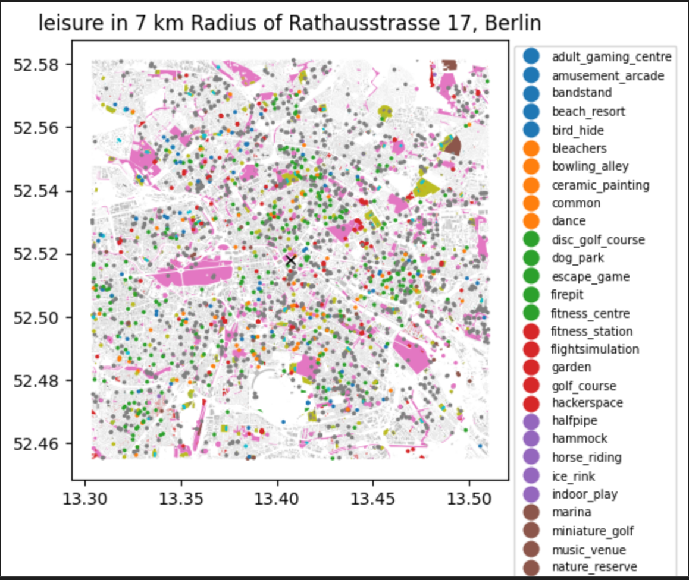
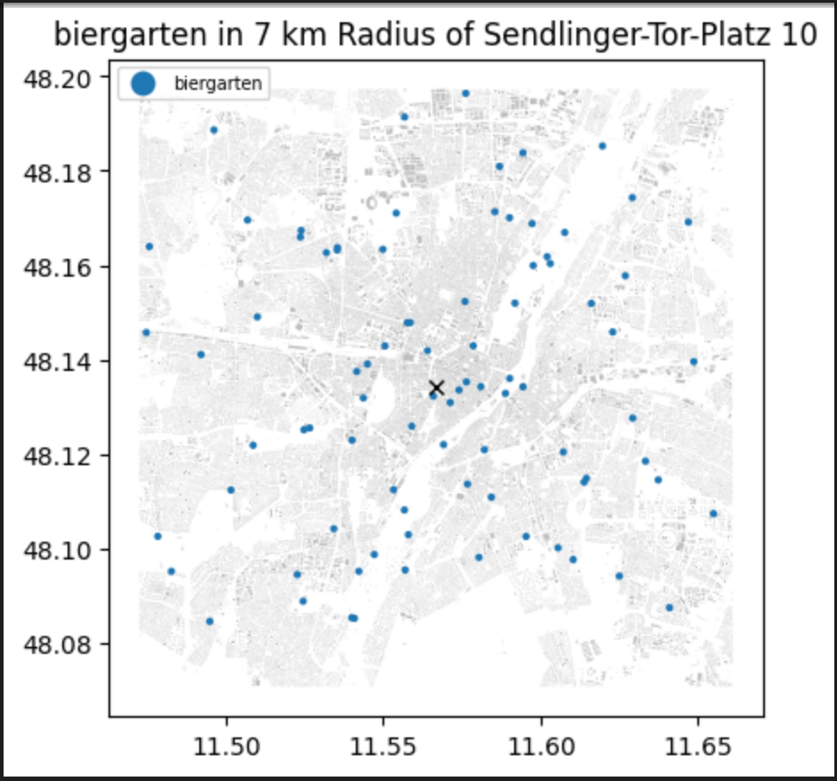
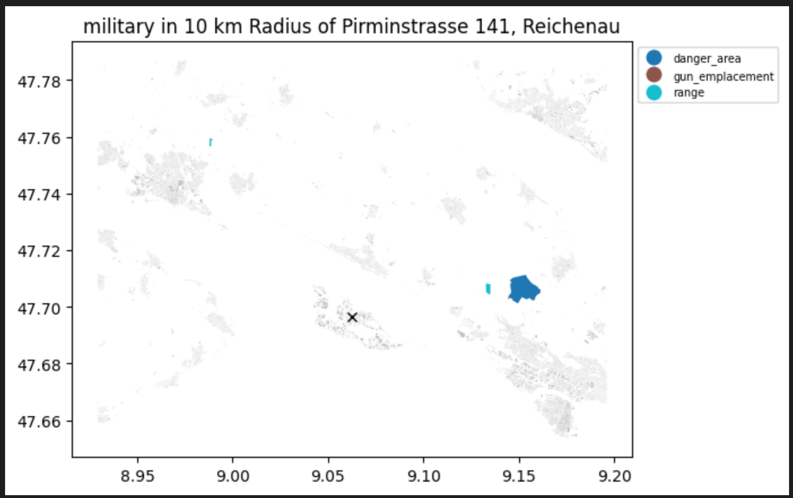

# **Finding the Closest OSM Objects to me**

#### This tool is for getting OSM objects and sorting them by distance.

## Quick Start
```bash
pip install -r requirements.txt
sudo snap install ollama
ollama create qwen2.5:translate -f system_prompt_translate
python3 main.py <your_osm_tag> '<your_address>'
```
Use ```python3 main.py --help``` for more information.
OSM tags can be found here: https://wiki.openstreetmap.org/wiki/Map_features.
See below for detailed installation instructions.

## Summary
OSM stands for OpenStreetMap, and is an open-source project with the goal of being a "free, editable map of the whole world made by people like you". 

The tool consists of a command-line tool, and a jupyter notebook 'demo' tool that plots the results.

Currently, due to data and scope limitations, this tool only allows locations in Germany.

Examples of the jupyter notebook plots:





## **Installation from clean Ubuntu**

Install git
```bash
sudo apt install git
```
Authenticate yourself to git.
Clone this repository, then ```cd``` into it.

### Setting up the environment
Install Virtualenv or Anaconda. Install Virtualenv with these commands:
```bash
sudo apt update
sudo apt install python3-virtualenv
```
Create the virtual environment.
```bash
python3 -m virtualenv myvenv
source myvenv/bin/activate
```
Install the required libraries:
```bash
pip install -r requirements.txt
```
### Setting up the chatbot

Install ollama from the [ollama download page](https://ollama.com/download).

Run these commands:
```bash
ollama create qwen2.5:translate -f system_prompt_translate
```
Ollama is really bad at freeing ram for itself. If it gives you an 'out of ram' error, try freeing up some ram manually.
## **Running the program**
There are two parts to this program: a jupyter notebook file (main.ipynb) and a CLI-functional file (main.py).
Both take ~30-60s to run, so be patient!
#### Running the jupyter notebook:
```bash
jupyter notebook
```
Click on the browser link, then open ```main.ipynb``` and run it.

#### Running the CLI program:
```bash
python3 main.py healthcare=psychotherapist 'lehener str 90 freiburg'
```
will look for all psychotherapists near 'lehener str 90'.
OSM tags can be found here: https://wiki.openstreetmap.org/wiki/Map_features
Use ```python3 main.py --help``` for more information.

## Credits
This is currently a solo project, but feel free to join in.
